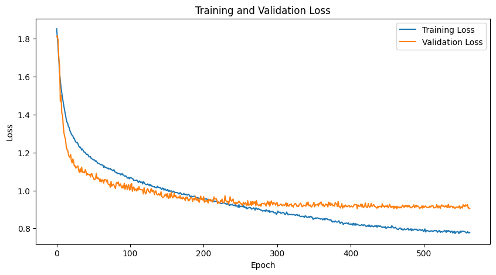
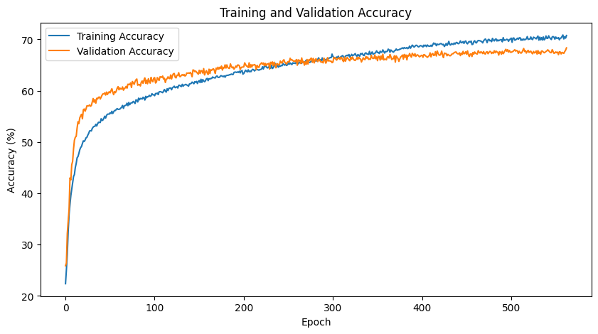
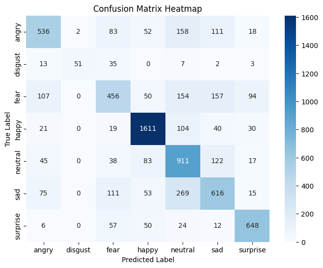
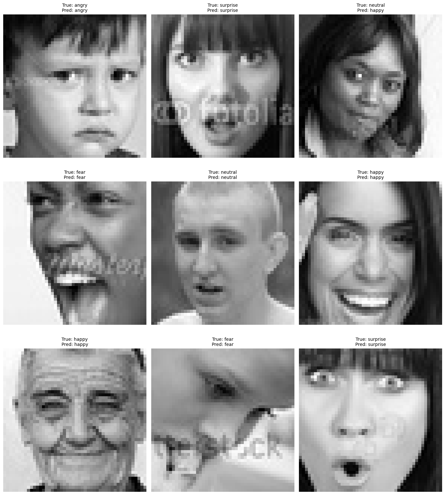

# Emotion Recognition CNN with PyTorch

## Project Goal

This project implements a Convolutional Neural Network (CNN) using PyTorch to recognizeseven emotion categories from facial images. 

## Dataset

* **Data Source:** The model is trained and validated on `FER2013` Dataset .
* **Image Specifications:** Images are grayscale and 48x48 pixels.
* **Classes:** The model detects the following emotions based on the validation dataset folders:
    * angry
    * disgust
    * fear
    * happy
    * neutral
    * sad
    * surprise

## Data Augmentation

The following data augmentation techniques are applied to the training dataset to improve model robustness:

* Grayscale conversion (1 channel)
* Resize to 48×48
* Random Horizontal Flip
* Random Affine Transform (±10° rotation, 10% translation)
* Conversion to Tensor
* Normalization (mean=0.5, std=0.5)

## Model Architecture

The model is a custom CNN architecture consisting of:

1. **Four Convolutional Blocks:**
   - Each block contains: Conv2D layer, BatchNorm2D, ReLU activation, MaxPool2D, and Dropout (p=0.36).
   - Block details:
     - Conv1: 1 input channel → 64 output channels (3×3 kernel)
     - Conv2: 64 → 128 (5×5 kernel)
     - Conv3: 128 → 256 (3×3 kernel)
     - Conv4: 256 → 256 (3×3 kernel)

2. **Flattening Layer:**
   - Output shape after Conv4 and pooling: (256, 3, 3) → flattened to 2304 features.

3. **Two Fully Connected Layers:**
   - FC1: Linear(2304 → 256) + BatchNorm1d + ReLU + Dropout(0.36)
   - FC2: Linear(256 → 512) + BatchNorm1d + ReLU + Dropout(0.36)

4. **Output Layer:**
   - FC3: Linear(512 → 7) for emotion classification (7 classes)

## Usage

### Training

**Configuration**

- **Model:** `EmotionRecognitionModelPyTorch`
- **Loss Function:** `CrossEntropyLoss`
- **Optimizer:** `Adam` with a learning rate of `0.0001`
- **Scheduler:** `ReduceLROnPlateau` (`mode='min'`, `factor=0.5`, `patience=50`)

**Training / Validation Loop**

- Load and preprocess the training and validation data with augmentation.
- Add Gaussian noise to training inputs during each batch to improve robustness.
- Adjust the learning rate using the `ReduceLROnPlateau` scheduler based on validation loss.
- Apply early stopping with a patience of 205 epochs if validation loss does not improve.
- Save the best-performing model (based on validation loss) to `checkpoint.pth`.
- Plot training and validation loss and accuracy curves after training completes.

### Evaluation

- The final notebook cell loads the best saved model from `checkpoint.pth`.
- It selects 9 random images from the validation set.
- The model performs predictions on these images.
- Each image is displayed using Matplotlib, annotated with its true and predicted labels.

### Model Performance

- **Early Stopping Triggered:** Training was stopped early after no improvement in validation loss for 50 epochs.
- **Best Model Loaded:** The best model, based on the lowest validation loss, was loaded from `best_emotion_recognition_model.pth`.
- **Final Validation Loss:** 0.9049
- **Final Validation Accuracy:** 68.34%

Below are the plots showing the training and validation loss curves as well as accuracy curves throughout the training process.

#### Training and Validation Loss

#### Training and Validation Accuracy

### Confusion Matrix

The confusion matrix visualizes the model's performance on the validation dataset, showing how well it predicts each emotion category.

### Evaluation

The evaluation section includes random predictions made by the model on 9 validation images. Here is a sample of the model's predictions alongside the true labels.

## Saved Model

* The weights of the best performing model during training are saved to `checkpoint.pth`.
